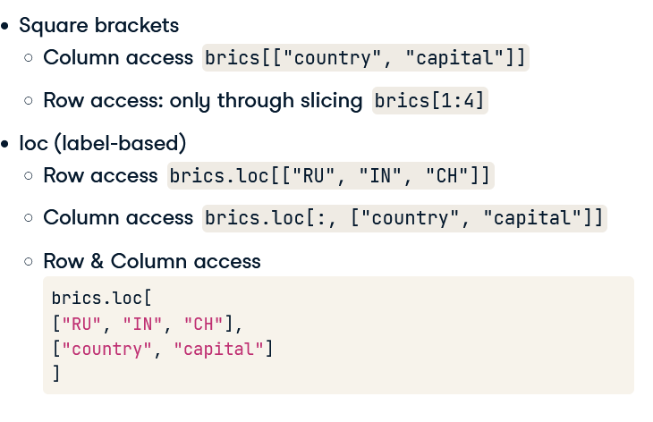

# Intermediate Python

## Dictionaries & Pandas

### Dictionaries, Part - 1

**Dictionary** -

1. A Dictionary is a set of key-value pairs.
2. The keys in a dictionary should be unique.
3. These unique keys should be immutable. The immutable objects cannot be changed after they are created.
4. Strings, Booleans, Integers, and Floats are immutable objects.
5. But the list is mutable because you can change its contents after it's created.
6. A dictionary with all immutable objects as keys is perfectly valid.
7. However, `{["just", "to", "test"]: "value"}`, this dictionary uses a list as a key, it is not valid, Hence we will get an error.

**Adding into a Dictionary** -

1. Suppose we want to add a key-value pair to the dictionary.
2. To add int we just write the name of the key-value pair.

```python
   #E.g
   world["sealand"] = 0.000027
```

3. If we check out the world again we will see the changes in the dictionary.
4. We can also use `sealand in world` this will return the value `true`.

**Creating a Dictionary** -

1. To create the dictionary, you need curly brackets.
2. Next, inside the curly brackets, you have a bunch of what are called key-value pairs.
3. To find the value of something in dictionary - E.g - `world["albania"]`.
4. Here `albania` is the key and the E.g will give the index of 'albania' in the array Europe.

```python
world = {"afghanistan" : 30.55, "albania" : 2.77, "algeria" : 39.21}
```

### Dictionaries, Part - 2

**List V/S Dictionary** -

| List                                                                   | Dictionary                       |
| ---------------------------------------------------------------------- | -------------------------------- |
| Select, Update, Remove with [ ].                                       | Select, Update, remove with [ ]. |
| Indexed by range of numbers.                                           | Indexed by unique keys.          |
| Collection of Values - order matters, for selecting the entire subset. | Lookup tables with unique keys.  |

### Pandas - 1

Pandas is a high-level data manipulation tool, built on the NumPy package.

Data can come in many forms: every row is a measurement or an observation, and for each observation, there are different variables.

**Datasets in Python** -

1. 2D NumPy Array ->
   1. It is an option to work with for our data, but it is not the best.
   2. In previous examples, there are different data types and NumPy arrays are not good at handling these.
   3. Your datasets will typically comprise different data types, so we need a tool that's better suited for the job.
   4. To easily and efficiently handle this data, there's the Pandas package.

**Pandas** -

1. Pandas is a high-level data manipulation tool developed by Wes McKinney, built on the NumPy package.
2. Compared to NumPy, it's more high level, making it very interesting for data scientists all over the world.
3. In pandas, we store the tabular data like the `brics table` here in an object called a **DataFrame**.
4. You see a similar structure as 2D NumPy Array in **DataFrame**: the rows represent the observations, and the columns represent the variables.

**Creating a DataFrame** -

1. DataFrame from a Dictionary -

   1. First of all, you can make a data frame manually, from a dictionary.
   2. Using the distinctive curly brackets, we create `key - value` pairs.
   3. The keys are the column labels, and the values are the corresponding column, in the list form.
   4. After importing the `Pandas` module. We can create a **DataFrame**.
   5. Code ->

   ```python
   import pandas as pd
   brics = pd.DataFrame(dict)
   #Here the brics is the new dataframe and dict the dictionary
   ```

   1. Pandas assign some automatic row labels.
   2. To specify them manually, you can set the index attribute of BRICS list with correct labels.

For huge amounts of data, we cannot use the Manual Method.

2. Import data from an External File to create a DataFrame -

   1. Code ->

   ```python
      brics = pd.read_csv('brics.csv')
   ```

   2. If you now print brics, there's still something wrong. The row labels are seen as a column in their own right.
   3. To solve this, we'll have to tell the read_csv function that the first column contains the row indexes.
   4. You do this by setting the index_col argument, like this `brics = pd.read_csv('brics.csv', index_col=0)`

`CSV - Comma Separated Values`

### Pandas - 2

We need to make sure that the data frame has the rows and columns with given appropriate labels. This is important to make accessing columns, rows and single elements in your DataFrame easy.

There are numerous ways in which you can index and select data from DataFrames, so we'll take this step by step.

**Index and Select Data** -

1. Square Brackets
2. Advanced Methods
   1. loc
   2. iloc

**Column Access** -

- **Series Access** -

1. Suppose you want to select a column from a data frame.

2. E.g - `brics["country"]` -> This is of the type `pandas.core.series.Series`.

3. Series is like a 1-D array that can be labeled, just like a data frame. Otherwise put, if you put in a bunch of Series, you can create a DataFrame.

- **DataFrame Access** -

1. If you want to select the country column but keep the data in a DataFrame, you'll need double square brackets, like this.

2. E.g - `brics[["country"]]` -> This is of the type `pandas.core.frame.Dataframe`

3. We can also extend this call to having 2 or more columns.

4. E.g- `brics[["capital", "country" ]]`

5. If you look at it from a different angle, you're putting a list with column labels inside another set of square brackets, and end up with a `sub DataFrame`, containing only the country and capital columns.

**Row Access** -

- **Slice**

1. We can also use the same square brackets to select the rows from a data frame.
2. E.g- `brics[1:4]` -> This will give us the 2nd, 3rd, and 4th row of the BRICS data frame.
3. The end of the slice is exclusive and the index starts from zero.
4. These square brackets work only and offer limited functionality. Ideally, we want something similar to a 2-D Numpy Array.
5. Ideally, we'd want something similar to 2D NumPy arrays.
6. There, you also used square brackets, the index or slice before the comma referred to the rows, and the index or slice after the comma referred to the columns.
7. E.g- `my_array[rows, column]`

- **LOC and ILOC**

1. If we want to do a similar thing with Pandas, we have to extend our toolbox with the loc and iloc functions.
2. loc is a technique to select parts of your data based on labels, iloc is position-based.

- **LOC**

1. You put the label of the row of interest in square brackets after loc.
2. E.g- `brics.loc["RU"]`
3. Again, we get a Pandas Series, containing all the row's information, rather inconveniently shown on different lines.
4. To get a data frame, we have to put the string inside another pair of brackets.
5. E.g- `brics.loc[['RU']]`
6. Selecting Multiple Rows -

## Types of Functions

1. `plt.index()` -
   1. index(), a list method.
   2. Return the index an element is present in.
   3. E.g- `Ind_lib = countries.index('albania')` -> This will return the index of albania in countries array.
2. `europe.keys()` -
   1. This method returns all the keys present in the europe dictionary.
   2. Works on dictionary.
   3. Here europe is the name of the dictionary we can have any dictionary.
3. `del()` -
   1. We can delete the elements in the element inside the del function.
   2. E.g- `del(world['sealand]')` -> This will delete the sealand from the dictionary.
4. `*dataframe*.index` -

   1. It changes the row labels which are set from 0 to ..., to the new value.
   2. E.g -

      ```python
        cars.index = row_labels
        # row_labels = ['US', 'AUS', 'JPN', 'IN', 'RU', 'MOR', 'EG']
        # Here the dataframe is cars, and we set the arr row_label as the default row.
      ```

5. `type()` -
   1. It returns the type of object present inside the parenthesis.
   2. E.g - `type(brics["country"])` will return `pandas.core.series.Series`.
6. `brics.loc[]` -
   1. Here brics is the name of the data frame. We can use any data frame that we want.
   2. LOC provides the functionality to select rows provided inside the `[]`.
   3. E.g - `brics.loc["RU"]`.
   4. Again, we get a Pandas Series, for the above-written code, containing all the row's information, rather inconveniently shown on different lines.
   5. Get a data frame - We have to put the string inside another pair of brackets.
   6. E.g- `brics.loc[['RU']]`
   7. Selecting Multiple Rows - We just provide a list as input in the brackets.
   8. E.g- `brics.loc[['RU', 'IN', 'CH']]`.
   9. This only selecting entire rows, that's something we could only do with the basic square brackets.
   10. While the difference here is that you can extend your selection with a comma and a specification of a column of interest.
   11. E.g- `brics.loc[['RU', 'IN', 'CH'], ['country', 'capital']]`.
   12. The intersection of these 3 rows and 2 columns get returned.
   13. We can also use loc to select all rows but only a specific number of columns.
   14. Simply replace the first list that specifies the row labels with a colon, a slice going from beginning to end. This time, the intersection spans all rows, but only two columns.
   15. E.g - `brics.loc[:, ['country', 'capital']]`.
   16. 
7. `brics.iloc[]` -
   1. If you want to subset Pandas Data frame based on their positions. or index, you'll need to use the iloc function.
   2. The df starts from 0, so the first element is the 0th element.
   3. E.g - `brics.iloc[[1]]` -> This will return the element on the 2nd row.
   4. For multiple rows, we can just give a list as input.
   5. E.g - `brics.iloc[[1,2,3]]`
   6. For the selection of specific columns and rows.
   7. E.g - `brics.iloc[[1,2,3], [1,2]]`
   8. For all rows and some columns.
   9. E.g - `brics.iloc[:, [1,2]]`
